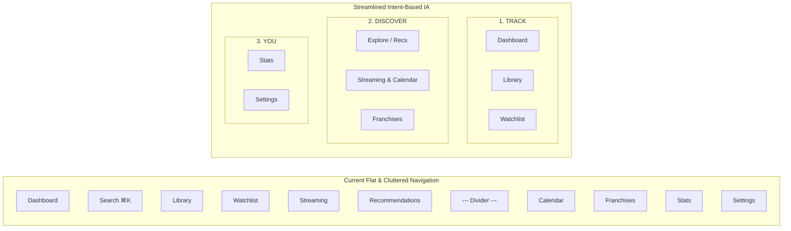
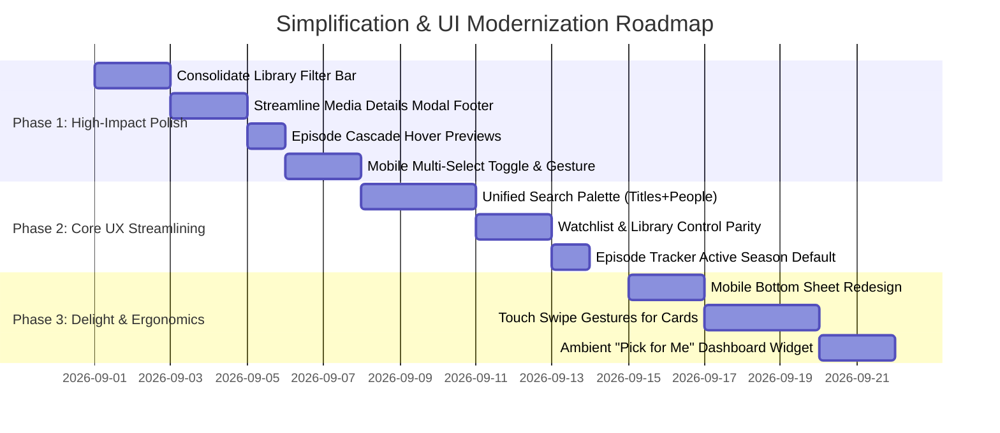

# DorfMovies (MediaTracker) — Master Frontend UX/UI & Usability Deep Audit

**Audit Date**: 2026-08-31  
**Target Codebase**: `mediatracker` (DorfMovies)  
**Corpus**: `philly0105/mediatracker`  
**Focus**: Radical Simplification, Cognitive Friction Reduction, Information Architecture Optimization, Mobile & Touch Ergonomics, "Autumn Pine" Design System Compliance, and WCAG 2.2 Accessibility.

---

## 1. Executive Summary & Core Philosophy

`mediatracker` (DorfMovies) is a fast, highly capable, and aesthetically distinct personal media tracking application built with **Next.js 16 (App Router)**, **React 19**, **Tailwind CSS v4**, and **Supabase (PostgreSQL + RLS)** with **TMDB** as its media data provider.

The application boasts disciplined data-fetching patterns, strict validation layers, optimistic mutations with undo toasts, and a distinct aesthetic identity ("Autumn Pine": warm brown-black canvas `#100e09`, pine accent `#7c9a6a`, warm stone ramp, flat opaque surfaces).

However, as features expanded (multi-select batching, multi-mode ⌘K palette, complex filter matrices, episode cascade tracking, streaming availability, collection backfills, and recommendation seed cycling), **frontend cognitive load and UI friction increased**. Users encounter dense control banks, ambiguous action hierarchies, hidden touch gestures, and fragmented terminology.

```
       COMPLEXITY PARADOX IN CURRENT UI
+-----------------------------------------------+
|  Feature Richness:    [██████████████████] 95% |
|  Data Resilience:     [██████████████████] 92% |
|  Visual Personality:  [████████████████  ] 88% |
|  Interface Simplicity:[██████            ] 42% |  <-- Primary Target
|  Mobile Ergonomics:   [███████           ] 48% |  <-- Primary Target
+-----------------------------------------------+
```

### Core User Archetypes & Needs
1. **The Casual Moviegoer**: Wants to log what they just watched in < 2 taps, check their watchlist, and decide what to watch tonight with zero visual noise.
2. **The TV Binge-Watcher**: Wants to effortlessly check off episodes without guessing cascade rules, see upcoming season premieres, and resume right where they left off.
3. **The Cinephile Collector**: Wants clean franchise tracking, director deep dives, custom ratings/reviews, and an uncluttered visual poster wall.

---

## 2. Information Architecture & Global Navigation Audit

### 2.1 Desktop Sidebar (`components/Sidebar.tsx`)



#### Key Findings:
1. **Arbitrary Divider Grouping (`components/Sidebar.tsx:37-51, 111`)**:
   - The desktop rail lists **8 primary items** split by a single visual line divider.
   - *Issue*: Why are *Streaming* and *Recommendations* above the divider while *Stats* and *Franchises* are below? There are no category headers, which leads to cognitive scanning fatigue.
   - *Fix*: Structure the sidebar with distinct, quiet eyebrow section headers: `TRACK`, `DISCOVER`, and `INSIGHTS`.
2. **Mobile Navigation Redundancies (`components/Sidebar.tsx:152-259`)**:
   - On mobile, the top bar renders: `DorfMovies` (Logo) + `Search` (Icon) + `Avatar` (Link to Settings).
   - The bottom bar renders: `Dashboard` + `Search` + `Library` + `Watchlist` + `More`.
   - *Issue*: **Search appears in three separate locations** on a single mobile screen (Top header icon, bottom bar tab, and dashboard hero search bar).
   - *Fix*: Remove the `Search` button from the bottom mobile bar. Use the bottom bar strictly for core destinations (`Dashboard`, `Library`, `Watchlist`, `Discover`, `More`).
3. **"More" Drawer Ergonomics (`components/Sidebar.tsx:271-332`)**:
   - Tapping "More" opens a bottom sheet with a 4-column grid of icons.
   - *Issue*: The grid icons are small (10px text, 20px icons) with low touch padding, making them prone to mis-taps.
   - *Fix*: Convert the "More" drawer into a full-width list row layout with larger touch targets (minimum 48px height per row) and descriptive secondary subtitles (e.g. *Franchises — Series & Sagas*).

---

## 3. Forensic Route-by-Route UX & Usability Audit

---

### Route 1: Dashboard (`app/(app)/page.tsx`)

```
CURRENT DASHBOARD LAYOUT:
+-------------------------------------------------------------------------------+
| PageHeader: "Dashboard"           [ DashboardSearchBar: Quick log a movie... ]|
| ----------------------------------------------------------------------------- |
| BentoGrid:                                                                    |
| [ Year 2026: 42 ] [ Must Watch: 14 ] [ Release Calendar: 3 upcoming items   ] |
|                                      [ (Suspense-streamed from TMDB)        ] |
| ----------------------------------------------------------------------------- |
| Continue Watching:                                                            |
| [<] [>] (Scrollable Row: Severance S2 E4, Shogun S1 E8, etc.)                 |
| ----------------------------------------------------------------------------- |
| Recently Watched:                                                    View all |
| [Poster 1] [Poster 2] [Poster 3] [Poster 4] [Poster 5]                        |
+-------------------------------------------------------------------------------+
```

#### Usability Friction Points:
1. **Redundant Search Trigger (`components/DashboardSearchBar.tsx:8-17`)**:
   - The hero search bar resembles an active input field, but clicking it opens a full-screen modal scrim.
   - *UX Problem*: Users expect to type directly into an input field on desktop rather than being interrupted by a modal scrim.
   - *Fix*: Turn `DashboardSearchBar` into an active inline search field that displays an instant floating dropdown with live quick-add cards without obscuring the dashboard.
2. **Continue Watching Poster Proportions (`components/ContinueWatchingRow.tsx:251-267`)**:
   - Poster thumbnail uses `h-24 w-16 rounded-[var(--radius-xl)]`.
   - *Visual Problem*: Applying a 16px radius to a 64px-wide image produces a pill/capsule distortion that clips title artwork at the corners.
   - *Fix*: Change radius to `rounded-lg` (8px) for small thumbnails.
3. **Stat Tile Interactivity Affordance (`components/ui/StatTile.tsx:9-40`)**:
   - Stat tiles are wrapped in `<Link>` tags (`app/(app)/page.tsx:154,166`), but have no hover lift or active state styling in CSS.
   - *UX Problem*: Users do not realize clicking "Year 2026" navigates to `/stats` or clicking "Must Watch" navigates to `/watchlist`.
   - *Fix*: Add `.card-interactive` styling and subtle directional chevron icons (`ChevronRight`) to interactive stat tiles.

---

### Route 2: Library (`app/(app)/library/page.tsx` & `components/LibraryView.tsx`)

```
CURRENT LIBRARY FILTER BAR (9 SEPARATE CONTROL GROUPS):
+---------------------------------------------------------------------------------------------------+
| [All] [Movies] [Shows]  [Recent] [Rating] [Name] [Year]  [All] [4+] [3+] [2+] [Unrated]           |
| [All Genres v]  [All Years v]  [Search titles, director, cast...           ]  [Clear]  [::][=] [R]|
+---------------------------------------------------------------------------------------------------+
```

#### The Problem:
This is the single most cluttered surface in the entire application. It contains **9 control groups** with **17 individual clickable targets** in a single container. On viewports between 640px and 1200px (tablets and laptops), this creates an unsightly 3-to-4 row visual barricade of pills and dropdowns.

```
PROPOSED STREAMLINED LIBRARY TOOLBAR:
+---------------------------------------------------------------------------------------------------+
| [All | Movies | TV Shows]   [Search your library...                    ]   [Filters (2) v]  [::][=]|
+---------------------------------------------------------------------------------------------------+
                                                                                     |
                                                                   +-----------------+--------------+
                                                                   | SORT BY:                       |
                                                                   | (•) Recent  ( ) Rating         |
                                                                   | ( ) Title   ( ) Release Date   |
                                                                   | ------------------------------ |
                                                                   | MINIMUM RATING:                |
                                                                   | [Any] [★ 4+] [★ 3+] [★ 2+]     |
                                                                   | ------------------------------ |
                                                                   | GENRE:       DECADE:           |
                                                                   | [Sci-Fi  v]  [2020s   v]       |
                                                                   | ------------------------------ |
                                                                   | [ Reset all ]   [ Done ]       |
                                                                   +--------------------------------+
```

#### Code-Level Flaws & Fixes:
1. **Filter Wrapping Chaos (`components/LibraryView.tsx:426-510`)**:
   - All pills, selects, search inputs, clear button, view switcher, and refresh button are inside one `flex-wrap` container.
   - *Fix*: Extract secondary filters (`genre`, `decade`, `rating`, `sort`) into a single accessible `<FilterPopover>` component with a badge showing active filter count.
2. **Hidden Actions in Poster Grid (`components/MediaCard.tsx:82-102`)**:
   - In poster grid view (`view === 'poster'`), the Edit and Delete buttons are rendered inside an absolute hover container (`md:opacity-0 md:group-hover/poster:opacity-100`).
   - *UX Problem*: On mobile devices, `hover` does not exist. Users must tap the card to see the buttons, but tapping the card triggers `openDetails()`! This makes editing or deleting an entry from poster grid mode impossible without opening the full modal.
   - *Fix*: On touch viewports, long-pressing a poster or tapping a dedicated `...` card trigger should present an action sheet.
3. **Swallowed Initial Load Errors (`components/LibraryView.tsx:187-189`)**:
   - When the initial fetch fails, `setEntries([])` is set and the error is swallowed.
   - *UX Problem*: If the network drops or auth token expires, the user sees "No titles logged yet" instead of an error state with a retry button.
   - *Fix*: Maintain an explicit `loadError` state and render `<SectionError onRetry={handleRefresh} />`.

---

### Route 3: Watchlist (`app/(app)/watchlist/page.tsx`)

```
CURRENT WATCHLIST STRUCTURE:
+-------------------------------------------------------------------------------+
| Watchlist · Up next                                                           |
| [Search...] [All Types v] [All Genres v] [Recently Added v] [Pick for me]     |
| ============================================================================= |
| 🔥 MUST WATCH (4)                                                             |
|   [Card 1] [Card 2] [Card 3]                                                  |
| ✨ WANT TO WATCH (18)                                                         |
|   [Card 4] [Card 5] [Card 6] ... [Show all 18]                                |
| 📥 SOMEDAY (6)                                                                |
|   [Card 7] [Card 8]                                                           |
+-------------------------------------------------------------------------------+
```

#### Usability Friction Points:
1. **Control Disparity Between Library & Watchlist (`watchlist/page.tsx:427-468`)**:
   - Library uses `<FilterPills>` for type filtering (`[All] [Movies] [Shows]`), while Watchlist uses a native `<Select>` dropdown (`<option value="all">All Types</option>`).
   - *UX Problem*: Breaks the user's muscle memory between sibling tracking views.
   - *Fix*: Standardize on `<SegmentedControl>` or `<FilterPills>` across both views.
2. **Card Priority Switching Micro-Interaction (`watchlist/page.tsx:620-658`)**:
   - Priority reassignment buttons (`Flame`, `Sparkles`, `Inbox`, `Trash`) appear as a dense 4-icon cluster on card hover.
   - *HCI Issue*: Target size for each icon is only 24x24px, violating the 44x44px touch target guideline. Mis-clicking `Trash` when aiming for `Someday` causes accidental item removals.
   - *Fix*: Replace the tiny icon cluster with a clean priority badge dropdown selector on the card, and support touch swipe gestures on mobile.
3. **"Pick for Me" Feature Under-Promoted (`components/TonightPickModal.tsx`)**:
   - "Pick for me" is a premier feature that solves decision paralysis for users. Currently, it is just a plain button at the end of the filter row.
   - *Delight Enhancement*: Elevate "Pick for me" into a floating quick-action pill or feature it in the Dashboard hero.

---

### Route 4: Media Details Modal (`components/MediaInfoModal.tsx`)

```
CURRENT MODAL FOOTER BUTTON OVERLOAD (UP TO 5 FULL-WIDTH/FLEX BUTTONS):
+-------------------------------------------------------------------------------+
| [ Add to Watchlist / Remove ] [ Mark as Watched / Log Rewatch ]               |
| [ Follow Show / Unfollow Show ]                                               |
| [ Track Episodes ]                                                            |
| [ Similar Movies / TV Shows ]                                                 |
+-------------------------------------------------------------------------------+
```

#### The Problem:
When viewing a TV show in `MediaInfoModal`, the footer displays up to **5 massive buttons** stacked in a vertical column or wrapped in a dense grid. There is **no visual hierarchy** indicating the single most important action.

```
PROPOSED STREAMLINED MODAL FOOTER:
+-------------------------------------------------------------------------------+
| [ ★ ★ ★ ★ ☆ ] 4.0/5 Your Rating                                              |
| ----------------------------------------------------------------------------- |
| [ ▶ Track Episodes (Next: S2 E1) ]  [ + Watchlist ]  [ ... More Actions ]     |
+-------------------------------------------------------------------------------+
                                                                |
                                             +------------------+---------------+
                                             | [✓] Mark entire show as watched  |
                                             | [🔔] Follow for new releases     |
                                             | [✨] View similar TV shows       |
                                             | [📺] Watch on JustWatch / IPTV   |
                                             +----------------------------------+
```

#### Code-Level Flaws & Fixes:
1. **Action Confusion for TV Shows (`components/MediaInfoModal.tsx:723-791`)**:
   - `Mark as Watched` creates a series-level `watch_entries` row, but does not check off episodes in `episode_progress`.
   - *UX Problem*: Users click "Mark as Watched" expecting it to mark Season 1 through N, and are baffled when their episode tracker still shows `0/24 episodes`.
   - *Fix*: If user clicks "Mark as Watched" on a show, show a 1-click prompt: *"Mark all 24 episodes as watched too? [Yes, mark all] [Series only]"*.
2. **Star Rating Precision & Cancel Affordance (`components/RatingStars.tsx:63-88`)**:
   - Half-star hit targets are split into left 50% / right 50% invisible absolute buttons.
   - *UX Problem*: On mobile touch screens, tapping a 16px-wide half-star zone without tactile feedback is imprecise.
   - *Fix*: Display an active numeric floating indicator on drag/touch (e.g. `[ 3.5 ★ ]`) above the star row.

---

### Route 5: Show Details & Episode Tracker (`components/EpisodeTracker.tsx`)

```
CURRENT ACCORDION & CASCADE BEHAVIOR:
+-------------------------------------------------------------------------------+
| v Season 1 (9/9 watched) [========================] 100%                      |
|   [ Unmark whole season ]                                                     |
|   [✓ E1] [✓ E2] [✓ E3] [✓ E4] [✓ E5] [✓ E6] [✓ E7] [✓ E8] [✓ E9]              |
| > Season 2 (0/10 watched) [------------------------] 0%                       |
| > Season 3 (0/8 watched)  [------------------------] 0%                       |
+-------------------------------------------------------------------------------+
```

#### Usability Friction Points:
1. **The Hidden Episode Cascade Rule (`components/EpisodeTracker.tsx:52-74`)**:
   - Clicking E5 marks E1 through E5 as watched. Clicking an already watched E5 unmarks E5 through E10.
   - *UX Problem*: While powerful, users unfamiliar with tracking conventions expect clicking E5 to toggle *only* E5. The UI provides no visual hint before clicking that a range will be modified.
   - *Fix*: When hovering over an unwatched E5, visually link E1 through E5 with a soft green hairline border and a badge: `Mark E1–E5`. When hovering over a watched E5, highlight E5 through E10 in soft rust: `Unmark E5–E10`.
2. **Static Season 1 Expansion (`components/EpisodeTracker.tsx:46`)**:
   - `const [open, setOpen] = useState<string | null>(seasons[0]?.id ?? null)`
   - *UX Problem*: If a user is actively on Season 4 Episode 3, opening the show detail page defaults to Season 1. The user must scroll down and manually expand Season 4 every single time.
   - *Fix*: Initialize `open` to the `season_id` of the `nextUp` episode.

---

### Route 6: Discovery, Streaming & Recommendations

#### Streaming Page (`app/(app)/streaming/page.tsx`):
1. **Provider Selector Overflow (`streaming/page.tsx:200-219`)**:
   - The 7 streaming providers (`Netflix`, `Hulu`, `Apple TV+`, `Disney+`, `Max`, `Prime`, `Peacock`) render as a single horizontal scrolling row on mobile with `overflow-x-auto`.
   - *UX Problem*: Providers at the end of the row (Peacock, Prime) are cut off without visual scroll affordance.
   - *Fix*: Use edge fade gradients (`from-[var(--bg-void)] to-transparent`) and responsive wrapping.
2. **"Hide Watched" Auto-Fill Throttling (`streaming/page.tsx:152-164`)**:
   - When "Hide Watched" is enabled, TMDB pages are fetched sequentially up to `MAX_AUTO_FILL_PAGES = 5` until 20 unwatched titles are found.
   - *UX Problem*: If a user has watched 90% of popular Netflix titles, the page shows a loading spinner for 3–4 seconds while sequential network requests resolve.
   - *Fix*: Display available titles immediately as each page arrives rather than holding the entire view behind a blocking spinner.

#### Recommendations Page (`app/(app)/recommendations/page.tsx`):
1. **Seed Rotation Discovery (`recommendations/page.tsx:74-111`)**:
   - The "Refresh" button rotates TMDB recommendation seeds.
   - *UX Problem*: Users are unaware that clicking "Refresh" pulls fresh recommendations based on different watched titles.
   - *Fix*: Add microcopy: *"Showing recommendations based on Dune & Severance. [Shuffle seeds]"*.

---

### Route 7: Command Palette (⌘K) & Quick Nav (`components/SearchOverlay.tsx`)

```
CURRENT SEARCH OVERLAY:
+-------------------------------------------------------------------------------+
| [ 🔍 Search movies and TV shows...                                          ] |
| ----------------------------------------------------------------------------- |
| [ Titles ]  [ People ]                                                        |
| ----------------------------------------------------------------------------- |
| RECENT                                                                [Clear] |
|   (🕒) Interstellar                                                          |
| GO TO                                                                         |
|   (🏠) Dashboard       (📚) Library         (📋) Watchlist                    |
|   (🎬) Streaming       (✨) Recommendations (📅) Calendar                     |
| ----------------------------------------------------------------------------- |
| ↑↓ Navigate   ↵ Open   ⌘↵ Watched   ⇧↵ Watchlist   Esc Close                  |
+-------------------------------------------------------------------------------+
```

#### Usability Friction Points:
1. **Siloed Mode Toggles (`components/SearchOverlay.tsx:301-315`)**:
   - The user must manually click between "Titles" and "People" tabs. Searching for "Denis Villeneuve" while on Titles mode yields 0 results.
   - *Fix*: Implement a **Unified Search Results Palette** with categorized headings:
     - `Top Match`
     - `Titles (Movies & TV)`
     - `People (Cast & Directors)`
     - `Quick Navigation`
2. **Power Shortcuts Discoverability (`components/SearchOverlay.tsx:536-547`)**:
   - `⌘↵` to mark watched and `⇧↵` to watchlist are listed in tiny 10px uppercase text in the footer.
   - *Fix*: Show shortcut badges directly inside the active list item row (e.g. `[⌘↵ Mark Watched]`).

---

### Route 8: Multi-Select & Bulk Batch Operations (`components/MultiSelectProvider.tsx`)

```
CURRENT MULTI-SELECT TOOLBAR:
+-------------------------------------------------------------------------------+
| [ 3 Selected ] | [ Select all 48 ] [ + Watchlist ] [ ✓ Watched ] | [ X ]      |
+-------------------------------------------------------------------------------+
```

#### Usability Friction Points:
1. **The Touch Invisibility Problem (`components/SelectableOverlay.tsx:42-55`)**:
   - The selection checkbox is styled as:
     ```tsx
     className={`... ${isSelected ? 'opacity-100' : isSelectMode ? 'opacity-100' : 'opacity-0 group-hover:opacity-100'}`}
     ```
   - *UX Problem*: On mobile devices, `group-hover` never fires. If `isSelectMode` is false, there is **zero visual indication** that cards can be multi-selected. A mobile user has literally no way to enter select mode!
   - *Fix*:
     1. Add an explicit `[Select]` toggle button in the page header on mobile.
     2. Add support for a 500ms **Long-Press gesture** on touch devices to activate select mode and select the pressed card.
2. **Toolbar Safe-Area Clipping (`components/MultiSelectProvider.tsx:175`)**:
   - Toolbar is positioned at `bottom-24 md:bottom-10`.
   - On smaller mobile viewports (e.g. iPhone SE), having the floating toolbar above the bottom navigation bar consumes over 30% of vertical screen space.
   - *Fix*: When select mode is active on mobile, temporarily replace the bottom navigation bar with the batch action bar.

---

### Route 9: Analytics & Stats (`app/(app)/stats/page.tsx` & `components/StatsCharts.tsx`)

#### Usability Friction Points:
1. **Pie Chart Label Clipping on Mobile (`components/StatsCharts.tsx:176-188`)**:
   - The Genre Breakdown pie chart renders text labels with radial offsets.
   - *Visual Problem*: On screens < 400px, genre labels (e.g. "Science Fiction", "Documentary") clip outside the viewport boundaries.
   - *Fix*: Switch to a clean horizontal bar chart or bottom legend list on mobile viewports (`< 640px`).
2. **Year Navigation Ergonomics (`components/StatsCharts.tsx:103-131`)**:
   - Years are listed as individual pill links (`Last 12 months`, `2026`, `2025`, `2024`, etc.). As the user logs media over multiple years, this row will wrap into multiple lines.
   - *Fix*: Wrap year selection into a `<Select>` dropdown or scrollable pill carousel.

---

### Route 10: Franchises & Collections (`app/(app)/collections/page.tsx`)

#### Usability Friction Points:
1. **Terminology Disconnect**:
   - The Sidebar says `Franchises`.
   - The page header says `Franchises / Series & sagas`.
   - The API and TMDB call them `Collections`.
   - The breadcrumb back button says `Collections` (`app/(app)/collections/[id]/page.tsx:78`).
   - *Fix*: Standardize user-facing terminology strictly to **Franchises** across all headers, breadcrumbs, and tooltips.

---

## 4. Design System Compliance Audit ("Autumn Pine")

The application's design system ("Autumn Pine") is defined in `.agents/skills/dorfmovies-design/` and vendored in `app/styles/design-system/`.

### 4.1 Token Alignment Matrix:

| Design Dimension | Design System Spec ("Autumn Pine") | Current Implementation Status | Audit Finding |
|---|---|---|---|
| **Canvas Background** | Warm brown-black `#100e09` | `var(--surface-page)` in `globals.css:78` | **Pass**: Correctly applied to `body`. |
| **Film Grain Overlay** | Fixed overlay, opacity `0.04-0.08` | `body::after` in `globals.css:87-96` | **Pass**: Non-interactive pointer-events-none. |
| **Primary Accent** | Pine Green `#7c9a6a` | `var(--accent)` / `var(--green-500)` | **Pass**: Clean single accent throughout. |
| **Rating Color** | Amber `#e5a93c` / `#f59e0b` | `var(--rating)` / `var(--amber-400)` | **Minor Drift**: Several files use raw Tailwind `text-amber-400` instead of `var(--rating)`. |
| **Destructive / Live** | Rust Red `#c85a48` | `var(--live)` / `var(--rust-500)` | **Pass**: Clean tone mapping in `Button.tsx`. |
| **Watched Status** | Teal `#2dd4bf` / `#38bdf8` | `var(--teal-400)` | **Pass**: Consistent progress bars and check icons. |
| **Card Radii** | Tight 4px–12px, pills for tags | `rounded-lg` (8px), `rounded-sm` (4px), `rounded-full` | **Pass**: Clean discipline; no pill buttons for cards. |
| **Backdrop Blur** | Strictly `0` (Opaque flat cards) | `var(--glass-card)` is flat `#1b1711` | **Pass**: No blurred glass haze; high performance. |

---

## 5. Accessibility (a11y) & Keyboard Flow Audit

### 5.1 WCAG 2.2 AA Assessment:

1. **Focus Trap & Retention (`lib/useModal.ts:67-90`)**:
   - `useModal` handles tab trapping and remembers previously focused elements upon close.
   - **Status**: Excellent. Screen readers properly receive focus redirection back to the originating card.
2. **Hidden Accessible Labels (`components/ui/Select.tsx:5-13`, `components/AuthShell.tsx:61-90`)**:
   - `Select` requires an explicit `label` prop for screen reader announcements.
   - `AuthInput` properly renders `<label className="sr-only">`.
3. **Screen Reader Chart Accessibility (`components/StatsCharts.tsx:31-70`)**:
   - Recharts SVG elements are paired with `<ChartFigure>`, which renders an invisible semantic `<table>` accessible to screen readers (`sr-only`).
   - **Status**: Industry Best Practice. Exceptional consideration for non-visual users.
4. **Touch Target Size Deficiencies**:
   - *Violation*: Rating half-stars, Watchlist priority hover icons, and mobile drawer items fall below the **44x44px minimum touch target size** mandated by WCAG 2.5.5.
   - *Fix*: Expand touch padding using invisible pseudo-elements (`::after` with `inset: -8px`).

---

## 6. Comprehensive Usability Simplification Matrix

| Screen / Component | Current Cognitive Friction | Recommended Simplification | User Impact |
|---|---|---|---|
| **Library View** | 9 filter controls form a 3-row visual wall | Consolidate into: `[Type Pills]` + `[Search Input]` + `[Filter & Sort (Count) Popover]` | **High**: Reduces visual clutter by 70%; restores immediate focus to media cards. |
| **Media Details Modal** | 5 competing buttons in footer | 1 Primary Action button (`Track Episodes` or `Mark Watched`) + 2 secondary icon buttons + overflow menu | **High**: Eliminates decision paralysis when opening title details. |
| **Episode Tracker** | Hidden cascade rule causes surprise range marking | Visual outline preview on hover (`Mark E1–E5` / `Unmark E5–E10`) | **High**: Prevents accidental batch markings and builds user confidence. |
| **Multi-Select** | Checkboxes are 100% invisible on mobile | Add header `[Select]` toggle + 500ms long-press card gesture on touch devices | **Critical**: Unlocks batch operations for mobile users. |
| **Search Overlay** | Siloed "Titles" vs "People" search modes | Unified search ranking showing top titles, people, and destinations together | **Medium**: Eliminates zero-result dead ends when searching for directors/actors. |
| **Watchlist** | Tiny 24px icon cluster for priority switching | Explicit priority dropdown badge on card + swipe actions on mobile | **Medium**: Prevents mis-clicks and accidental item deletions. |
| **Dashboard** | Redundant non-functional search bar in hero | Live inline instant search dropdown or replace with ambient "Pick for Me" widget | **Medium**: Streamlines dashboard entry point. |

---

## 7. Phased Implementation Blueprint & Engineering Roadmap



### Phase 1: Immediate High-Impact Simplification
1. **Library Filter Popover**: Refactor `components/LibraryView.tsx` to hide secondary filters (`sort`, `genre`, `decade`, `rating`) inside an accessible popover trigger with an active count badge.
2. **Media Modal Footer Restructure**: Update `components/MediaInfoModal.tsx` to feature a single dominant Primary Action button (`btn-primary`) and place secondary utilities in a dropdown or icon row.
3. **Episode Range Previews**: Update `components/EpisodeTracker.tsx` to add visual cascade range highlights on hover.
4. **Mobile Multi-Select Activation**: Add a visible "Select" button to `PageHeader` in multi-select enabled views.

### Phase 2: Core Flow Streamlining
1. **Unified ⌘K Search**: Blend TMDB title and person searches in `components/SearchOverlay.tsx` into categorized listbox sections.
2. **Standardize Control Primitives**: Harmonize `<FilterPills>`, `<SegmentedControl>`, and `<Select>` across Library, Watchlist, Streaming, and Recommendations.
3. **Smart Season Expansion**: Ensure `EpisodeTracker` automatically opens the season containing the user's `nextUp` episode.

### Phase 3: Advanced Delight & Mobile Polish
1. **Card Swipe Gestures**: Implement touch gestures for mobile cards (swipe right to mark watched, swipe left for actions).
2. **Elevated "Tonight's Pick"**: Feature the weighted recommendation picker directly in the Dashboard hero.
3. **Offline / Network Resilience**: Add explicit inline retry banners (`SectionError.tsx`) across all async data feeds.

---

## 8. Summary Table of Files & Actionable Next Steps

| File Path | Priority | Action Summary |
|---|---|---|
| [`components/LibraryView.tsx`](file:///c:/Users/aideo/Projects/mediatracker/components/LibraryView.tsx) | **P0** | Consolidate 9-control filter bank into a primary bar + `<FilterPopover>`. |
| [`components/MediaInfoModal.tsx`](file:///c:/Users/aideo/Projects/mediatracker/components/MediaInfoModal.tsx) | **P0** | Establish single Primary Action button in footer; move secondary actions to overflow. |
| [`components/SelectableOverlay.tsx`](file:///c:/Users/aideo/Projects/mediatracker/components/SelectableOverlay.tsx) | **P0** | Add mobile touch gesture (long-press) and header select button to unlock multi-select on phones. |
| [`components/EpisodeTracker.tsx`](file:///c:/Users/aideo/Projects/mediatracker/components/EpisodeTracker.tsx) | **P1** | Add cascade range outline on hover and default open accordion to `nextUp` season. |
| [`components/SearchOverlay.tsx`](file:///c:/Users/aideo/Projects/mediatracker/components/SearchOverlay.tsx) | **P1** | Unify Titles and People searches into a single blended palette. |
| [`app/(app)/watchlist/page.tsx`](file:///c:/Users/aideo/Projects/mediatracker/app/%28app%29/watchlist/page.tsx) | **P1** | Replace 24px hover priority cluster with dropdown badge selector. |
| [`components/Sidebar.tsx`](file:///c:/Users/aideo/Projects/mediatracker/components/Sidebar.tsx) | **P2** | Add category eyebrows (`TRACK`, `DISCOVER`, `INSIGHTS`) and remove mobile search duplication. |
